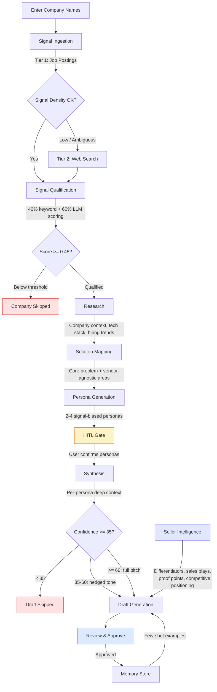

# SignalForge

**Proactive Sales Signal Intelligence Engine**

SignalForge replaces generic outbound prospecting with signal-driven, technically credible outreach. It discovers real buying signals from job postings and web sources, qualifies them against your capability map, and generates persona-targeted email drafts grounded in specific company context — so every message you send is relevant, timely, and sounds like it came from a peer, not a pipeline.

Built for cloud sales engineers, presales architects, and technical account executives who need to cut through inbox noise with outreach that demonstrates genuine understanding of a prospect's technical challenges.

---

## The Problem

Enterprise sales teams send thousands of emails that read like templates because they *are* templates. Even "personalized" outreach typically swaps in a company name and job title without understanding what the company is actually going through.

Meanwhile, the signals that indicate real buying intent — a company hiring for Kubernetes engineers, blogging about migration challenges, or reorganizing their platform team — are scattered across job boards, blogs, and news sites. Finding them manually doesn't scale. Acting on them requires connecting the dots between the signal, the right persona to target, and a message that bridges the prospect's pain to your solution.

**SignalForge automates this entire workflow**: signal discovery, qualification, persona mapping, and draft generation — with human-in-the-loop gates where judgment matters most.

## What It Does

**1. Discovers buying signals** from job postings (JSearch) and web sources (Tavily), using a cost-tiered approach that starts cheap and escalates only when signal density is low.

**2. Qualifies and scores signals** using a hybrid approach: deterministic keyword matching against your capability map (40%) combined with LLM-assessed severity across recency, specificity, technical depth, and buying intent (60%). Signals below threshold are filtered out — no false positives.

**3. Maps signals to solution areas** that are vendor-agnostic, so the analysis isn't just "they need your product" — it's "they have a container orchestration scaling problem that maps to platform engineering and observability capabilities."

**4. Generates personas** tied to signal type — hiring signals surface technical buyers and influencers, cost optimization signals surface economic buyers, security signals surface blockers. Each persona gets a priority score for outreach sequencing.

**5. Pauses for human judgment** at the persona selection gate. You confirm which personas to target, edit titles and targeting reasons, or add custom personas before any drafts are generated.

**6. Generates confidence-gated drafts** — high confidence signals get full solution pitches, marginal signals get hedged exploratory tone, and low confidence signals are skipped entirely. Your seller profile and portfolio are injected so outreach bridges to specific capabilities you actually sell.

**7. Learns from approvals** — approved drafts are stored in memory and used as few-shot examples for future sessions, so tone and style stay consistent across runs.

## How It Works



Every stage streams progress to the UI via WebSocket, so you see exactly where each company is in the pipeline.

## Business Value

| Pain Point | How SignalForge Addresses It |
|---|---|
| Generic outreach gets ignored | Every message is grounded in a specific, timely signal the prospect's company is broadcasting |
| Signal discovery doesn't scale | Automated multi-source ingestion with cost-aware tier escalation |
| Wrong persona, wasted effort | Signal-type-driven persona generation with human confirmation gate |
| "We sell everything" messaging | Vendor-agnostic solution mapping bridges signal to specific capability areas |
| Inconsistent voice across reps | Approved drafts train future output via few-shot memory |
| Outreach before research | Pipeline won't generate drafts without qualified signals and confirmed personas |

---

## Quick Start

### Prerequisites

- Python 3.11+
- Node.js 18+
- API keys: at least one LLM provider (Anthropic or OpenAI), JSearch, Tavily

### 1. Clone and install

```bash
git clone https://github.com/jshahid21/signalforge.git
cd signalforge

# Backend
pip install -e ".[dev]"

# Frontend
cd frontend && npm install && cd ..
```

### 2. Configure environment

```bash
cp .env.example .env
```

Edit `.env` with your API keys:

```bash
ANTHROPIC_API_KEY=sk-ant-...    # or OPENAI_API_KEY for GPT-4o
JSEARCH_API_KEY=...              # RapidAPI JSearch
TAVILY_API_KEY=tvly-...          # Tavily web search
```

### 3. Run

```bash
# Terminal 1 — Backend (FastAPI on :8000)
python -m backend

# Terminal 2 — Frontend (Vite on :5173)
cd frontend && npm run dev
```

### 4. First-run setup

Open `http://localhost:5173`. The setup wizard walks you through:

1. **Seller Profile** — your company name, portfolio summary, and product list
2. **API Keys** — LLM provider selection and signal source keys
3. **Capability Map** — auto-generated from your products, editable anytime

Then enter company names and start your first analysis session.

---

## Architecture

```
┌─────────────────────────────────────────────────────────┐
│                    React Frontend                        │
│  ┌──────────┐ ┌──────────┐ ┌───────┐ ┌──────────────┐  │
│  │ Company  │ │ Insights │ │Persona│ │    Draft     │  │
│  │  Table   │ │  Panel   │ │ Table │ │    Panel     │  │
│  └──────────┘ └──────────┘ └───────┘ └──────────────┘  │
│  ┌──────────────────┐  ┌─────────────────────────────┐  │
│  │  Setup Wizard    │  │      Chat Assistant         │  │
│  └──────────────────┘  └─────────────────────────────┘  │
│  Zustand state │ Axios HTTP │ WebSocket real-time events │
└────────────────┼───────────┼────────────────────────────┘
                 │           │
┌────────────────┼───────────┼────────────────────────────┐
│           FastAPI Backend  │                             │
│  ┌─────────────────────────┼──────────────────────────┐ │
│  │        REST API         │    WebSocket /ws/{sid}    │ │
│  │  /sessions  /personas   │    pipeline_started       │ │
│  │  /drafts    /settings   │    stage_update           │ │
│  │  /chat      /memory     │    hitl_required          │ │
│  │  /setup     /config     │    budget_warning         │ │
│  └─────────────┬───────────┴──────────────────────────┘ │
│                │                                         │
│  ┌─────────────┴──────────────────────────────────────┐ │
│  │              LangGraph Pipeline                     │ │
│  │  Signal       Signal        Research    Solution    │ │
│  │  Ingestion →  Qualification → (parallel) → Mapping  │ │
│  │                                                     │ │
│  │  Persona      HITL         Synthesis    Draft       │ │
│  │  Generation → Gate ──────→ (per-persona) → Gen     │ │
│  └────────┬──────────────────────────┬────────────────┘ │
│           │                          │                   │
│  ┌────────┴───────┐        ┌────────┴────────┐         │
│  │  Signal APIs   │        │    LLM APIs     │         │
│  │  JSearch       │        │  Claude / GPT-4o│         │
│  │  Tavily        │        │                 │         │
│  └────────────────┘        └─────────────────┘         │
│                                                         │
│  SQLite: sessions, memory    Config: ~/.signalforge/    │
└─────────────────────────────────────────────────────────┘
```

### Tech Stack

| Layer | Technology |
|---|---|
| Frontend | React 19, TypeScript, Vite, Tailwind CSS, Zustand |
| Backend | FastAPI, Python 3.11+, SQLAlchemy, Pydantic |
| Pipeline | LangGraph (StateGraph with parallel `Send()` per company) |
| LLM | Anthropic Claude / OpenAI GPT-4o (configurable) |
| Signal Sources | JSearch (job postings), Tavily (web search) |
| Real-time | WebSocket for pipeline events, SSE for chat streaming |
| Persistence | SQLite for sessions and approved draft memory |
| Observability | LangSmith tracing (optional) |

### Project Structure

```
signalforge/
├── backend/
│   ├── agents/                  # LangGraph pipeline nodes
│   │   ├── orchestrator.py      # Graph assembly + parallel dispatch
│   │   ├── signal_ingestion.py  # Cost-tiered signal acquisition
│   │   ├── signal_qualification.py  # Hybrid scoring
│   │   ├── research.py          # Company context extraction
│   │   ├── solution_mapping.py  # Vendor-agnostic mapping
│   │   ├── persona_generation.py    # Signal-biased personas
│   │   ├── hitl_gate.py         # Human-in-the-loop pause
│   │   ├── synthesis.py         # Per-persona deep context
│   │   ├── draft.py             # Confidence-gated generation
│   │   ├── seller_intelligence.py   # Website scrape + extraction
│   │   ├── chat_assistant.py    # Company-scoped chat
│   │   └── memory_agent.py      # Approved draft storage
│   ├── api/
│   │   ├── app.py               # FastAPI application
│   │   ├── session_store.py     # SQLite persistence
│   │   ├── websocket.py         # Event broadcasting
│   │   └── routes/              # REST endpoints
│   ├── config/                  # Config + capability map loader
│   ├── models/                  # Pydantic/TypedDict schemas
│   ├── tools/                   # JSearch, Tavily, web crawler
│   └── pipeline.py              # LangGraph StateGraph wiring
├── frontend/
│   └── src/
│       ├── App.tsx              # Main layout + session orchestration
│       ├── components/          # UI panels
│       ├── store/               # Zustand session state
│       └── api/                 # HTTP + WebSocket client
├── tests/                       # pytest + vitest suites
├── docs/
│   └── observability.md         # LangSmith setup guide
├── pyproject.toml
└── package.json
```

---

## Key Features

### Signal Discovery & Qualification

Signals are acquired through a cost-tiered system. Tier 1 (job postings via JSearch) runs on every company at ~$0.001/call. If signal density is low (<3 signals), ambiguity is high, or deterministic scoring returns zero, the system escalates to Tier 2 (Tavily web search at ~$0.015/call).

Qualification uses hybrid scoring: keyword overlap with your capability map (deterministic, 40% weight) plus LLM severity assessment across four dimensions (60% weight). The composite threshold of 0.45 filters noise while keeping genuine signals. If LLM scoring fails, the system falls back to deterministic-only scoring.

### Capability Map

Your capability map is the bridge between what prospects are struggling with and what you sell. It's auto-generated from your seller profile during setup and stored as YAML:

```yaml
capabilities:
  - id: container-orchestration
    label: Container Orchestration
    problem_signals: ["kubernetes", "container scaling", "microservices migration"]
    solution_areas: ["Platform Engineering", "Cloud Native Infrastructure"]
```

Editable anytime via the Settings panel — add, remove, or refine entries as your portfolio evolves.

### Seller Intelligence + Capability Map Integration

During setup, SignalForge auto-scrapes your company's public website to extract structured sales intelligence: differentiators, sales plays, proof points, and competitive positioning. This intelligence is automatically linked to your capability map entries, so when a signal matches a capability, the pipeline already knows your specific angle, proof points, and sales play for that problem.

The integration creates an explicit chain: **signal → matched capability → seller differentiator → relevant sales play → proof point → persona-targeted draft.** No LLM guessing required.

Additional seller context captured:
- **Target verticals / ICP** — which industries you sell best into
- **Value metrics** — quantified outcomes ("customers see 40% reduction in deploy time")
- **Industry classification** — research agent now detects prospect industry for stronger messaging

Sales plays can be manually entered or edited — web scraping catches use cases, but real sales plays are internal knowledge. The Settings panel lets you manage everything: view, edit, re-scrape, and manually enrich capability entries.

### HITL Persona Gate

The pipeline pauses after persona generation and before draft creation. This is intentional — persona selection is where human judgment adds the most value. The UI shows generated personas with role types (economic buyer, technical buyer, influencer, blocker), priority scores, and targeting reasons. You can:

- Confirm the suggested set
- Remove personas that don't fit
- Edit titles and targeting reasons
- Add custom personas

Only confirmed personas proceed to synthesis and draft generation.

### Confidence-Gated Drafts

Draft generation respects the solution mapping confidence score:

| Confidence | Behavior |
|---|---|
| < 35 | Draft skipped — signal too weak for credible outreach |
| 35–60 | Generated with hedged, exploratory tone |
| >= 60 | Full solution pitch with direct capability bridging |

Tone adapts to persona type — economic buyers get business impact and ROI framing, technical buyers get architecture and tradeoff language, influencers get pain-point-driven narratives, blockers get risk mitigation and compliance framing.

### Chat Assistant

A company-scoped conversational assistant that has full context on the selected company's signals, research, personas, and drafts. Use it to dig deeper into signals, ask follow-up questions, or explore angles the pipeline didn't surface. Responses stream via SSE.

### Session Management

Sessions persist in SQLite. The sidebar shows all past sessions — click to restore any previous session's full state. Sessions track per-company cost, pipeline stage, and all generated artifacts.

### Cost Control

Default budget: $0.50 per session (configurable). The system tracks cost at every pipeline stage and sends budget warnings at 75% consumption via WebSocket. Per-company cost breakdowns show exactly where budget was spent and which tier escalations were triggered.

---

## Configuration

### Environment Variables

| Variable | Required | Description |
|---|---|---|
| `ANTHROPIC_API_KEY` | One of these | Anthropic Claude API key |
| `OPENAI_API_KEY` | required | OpenAI API key |
| `JSEARCH_API_KEY` | Yes | RapidAPI JSearch key for job postings |
| `TAVILY_API_KEY` | Yes | Tavily API key for web search |
| `SIGNALFORGE_HOST` | No | Server bind address (default: `0.0.0.0`) |
| `SIGNALFORGE_PORT` | No | Server port (default: `8000`) |
| `LANGCHAIN_TRACING_V2` | No | Enable LangSmith tracing (`true`/`false`) |
| `LANGCHAIN_API_KEY` | No | LangSmith API key (required if tracing enabled) |

### Config Directory

SignalForge stores configuration at `~/.signalforge/`:

- `config.json` — seller profile, API keys, LLM provider, session budget
- `capability_map.yaml` — your capability-to-signal mapping

Both are managed through the UI (Setup Wizard and Settings panel).

### Observability

LangSmith integration provides production-grade observability with three layers:

- **Tracing** — Toggle on/off via Settings panel. When enabled, every LLM call across all 9 pipeline agents reports to LangSmith with structured trace trees (pipeline → company → stage → LLM call). Per-stage latency, token counts, and cost breakdowns.
- **Feedback** — Draft approvals log positive feedback (`score=1.0`) and regenerations log negative feedback (`score=0.0`) to LangSmith, tied to the originating trace via `run_id`. Enables prompt optimization based on real user signals.
- **Evaluation** — LLM-as-judge rubric scores drafts on technical credibility, tone adherence, and absence of generic phrases.

All gracefully no-op when tracing is disabled or LangSmith is not installed. See `docs/observability.md` for setup.

---

## Running Tests

```bash
# Backend (pytest)
pytest tests/

# Frontend (vitest)
cd frontend && npm run test
```

---

## Development

```bash
# Lint backend
ruff check backend/

# Lint frontend
cd frontend && npm run lint

# Type check frontend
cd frontend && npx tsc -b
```

---

## License

See [LICENSE](LICENSE) for details.
